# Beauty Salon Information System

> Портфолио-проект бизнес / системного аналитика  
> ВКР: информационная система управления салоном красоты на примере студии ногтевого сервиса

## Краткое Описание

`beauty-salon-information-system` - проект информационной системы для управления салоном красоты, специализирующимся на услугах маникюра и педикюра.

Репозиторий оформлен как аналитическое портфолио: основной акцент сделан на предметной области, требованиях, бизнес-правилах, моделировании процессов, проектировании базы данных, ролях пользователей, аналитических панелях и отчетности.

## Проблема Бизнеса

В небольших nail-студиях часть процессов часто ведется вручную или через несколько несвязанных инструментов: бумажные журналы, таблицы, мессенджеры и отдельные сервисы. По материалам ВКР это приводит к следующим проблемам:

- пересечения записей клиентов и сбои в расписании;
- потеря или дублирование клиентских данных;
- ошибки при расчете начислений мастеров;
- отсутствие точного контроля остатков материалов;
- высокая нагрузка на администратора в периоды плотной записи;
- ручная подготовка отчетности и управленческих показателей.

Готовые CRM-системы автоматизируют базовые задачи салона, но для небольших студий ногтевого сервиса могут быть избыточными, зависеть от SaaS-подписки или ограниченно поддерживать специфические правила: лимиты рабочих мест маникюра и педикюра, технологические карты услуг, автоматическое списание материалов и индивидуальные коэффициенты мастеров.

## Цель Системы

Цель системы - автоматизировать ключевые процессы студии ногтевого сервиса:

- онлайн-запись клиентов;
- управление расписанием и сменами мастеров;
- контроль доступности рабочих мест;
- учет расходных материалов;
- автоматическое списание материалов по технологическим картам;
- расчет начислений и KPI мастеров;
- формирование аналитики и управленческой отчетности.

## Роли Пользователей

| Роль | Зона ответственности |
| --- | --- |
| Администратор | Управляет записями, расписанием, мастерами, услугами, материалами, промокодами, настройками салона, аналитикой и отчетами. |
| Мастер | Работает со своими сменами, записями, статусами посещений и данными о начислениях. |
| Клиент | Создает онлайн-запись, просматривает историю визитов, отменяет активные записи, использует промокоды и программу лояльности. |

## Основной Функционал

- Пошаговая онлайн-запись с выбором услуги, мастера, даты и времени.
- Автоматический расчет свободных слотов с учетом смен, перерывов, существующих записей и лимитов рабочих мест.
- Календарь записей и смен мастеров.
- Ведение клиентской базы и истории посещений.
- Управление услугами, дополнительными услугами и технологическими картами.
- Учет материалов, контроль остатков и история движений.
- Автоматическое списание материалов после завершения визита.
- Расчет заработной платы мастеров по завершенным записям.
- KPI мастеров, загрузка, выручка, средний чек и процент отмен.
- Система лояльности и промокоды.
- Управленческие отчеты с экспортом в PDF и Excel.
- Разграничение доступа для администратора, мастера и клиента.

## Артефакты Аналитика

| Артефакт | Где находится |
| --- | --- |
| Описание предметной области | [`docs/architecture/domain-description.md`](docs/architecture/domain-description.md) |
| Бизнес-требования | [`docs/requirements/business-requirements.md`](docs/requirements/business-requirements.md) |
| Функциональные требования | [`docs/requirements/functional-requirements.md`](docs/requirements/functional-requirements.md) |
| Нефункциональные требования | [`docs/requirements/non-functional-requirements.md`](docs/requirements/non-functional-requirements.md) |
| Бизнес-правила | [`docs/business-rules/business-rules.md`](docs/business-rules/business-rules.md) |
| Роли пользователей | [`docs/requirements/user-roles.md`](docs/requirements/user-roles.md) |
| AS-IS / TO-BE | [`docs/requirements/as-is-to-be.md`](docs/requirements/as-is-to-be.md) |
| Проектирование БД | [`docs/architecture/database-design.md`](docs/architecture/database-design.md) |
| DFD онлайн-записи | [`diagrams/dfd/online-booking-dfd.png`](diagrams/dfd/online-booking-dfd.png) |
| UML Use Case | [`diagrams/uml/use-case-diagram.png`](diagrams/uml/use-case-diagram.png) |
| UML Sequence | [`diagrams/uml/online-booking-sequence.png`](diagrams/uml/online-booking-sequence.png) |
| IDEF3 завершения записи и списания материалов | [`diagrams/idef3/booking-completion-material-writeoff.png`](diagrams/idef3/booking-completion-material-writeoff.png) |
| ERD базы данных | [`diagrams/erd/database-erd.jpeg`](diagrams/erd/database-erd.jpeg) |

Отдельная BPMN-диаграмма в приложенном документе ВКР отсутствует, поэтому она не добавлялась искусственно. В репозитории сохранены фактические модели из материалов проекта: DFD, UML, IDEF3 и ERD.

## AS-IS / TO-BE

| Область | AS-IS | TO-BE |
| --- | --- | --- |
| Запись клиентов | Ручная обработка через звонки, сообщения, журналы или таблицы. | Онлайн-запись с выбором услуги, мастера, даты и свободного времени. |
| Расписание | Администратор вручную проверяет график и свободные интервалы. | Система проверяет смены, перерывы, существующие записи и лимиты рабочих мест. |
| Клиентские данные | Информация может храниться в разных каналах связи. | Единая клиентская база с историей посещений. |
| Материалы | Остатки контролируются вручную или с задержкой. | Автоматическое списание по технологическим картам после завершенных визитов. |
| Начисления и KPI | Ручной расчет по завершенным услугам и процентам. | Расчет по завершенным записям и настройкам мастеров. |
| Отчетность | Ручное формирование таблиц и сводок. | Аналитические панели и экспорт отчетов в PDF / Excel. |

## Диаграммы

### DFD: процесс онлайн-записи клиента

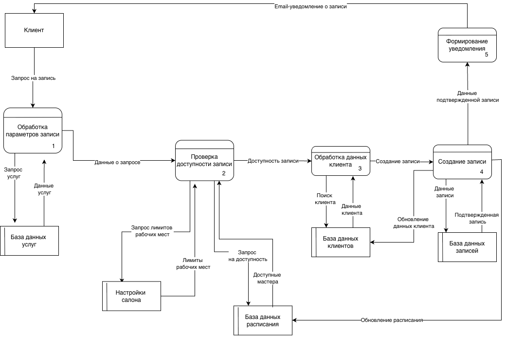

### UML: диаграмма вариантов использования

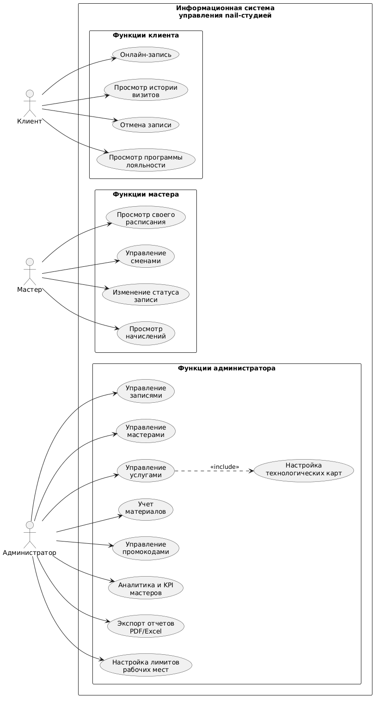

### UML: диаграмма последовательности онлайн-записи

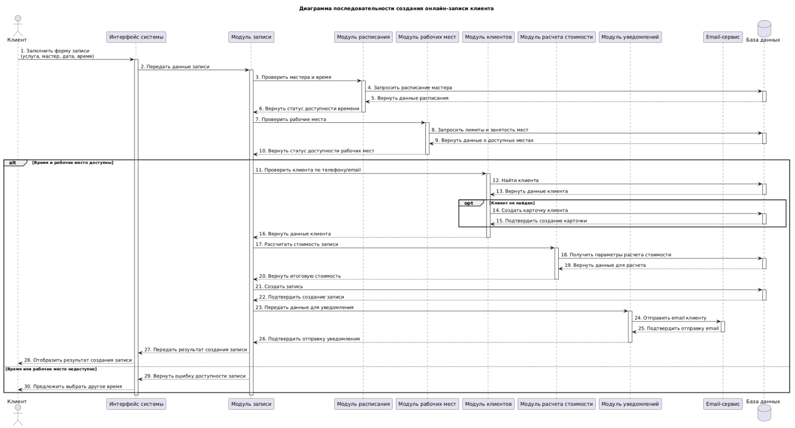

### IDEF3: завершение записи и списание материалов

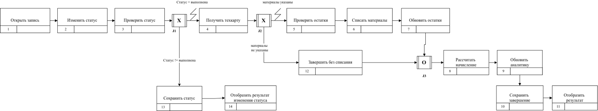

## Проектирование Базы Данных

Для хранения данных выбрана реляционная модель и MySQL. Центральная сущность системы - запись клиента, связанная с клиентом, мастером, основной услугой, дополнительными услугами, расписанием, материалами, промокодами и аналитикой.

Ключевые таблицы:

- `users` - учетные записи пользователей;
- `clients` - клиентская база салона;
- `masters` - данные мастеров, коэффициенты и процент начисления;
- `bookings` - записи клиентов;
- `services` - каталог услуг;
- `booking_service` - дополнительные услуги в записи;
- `service_addons` - допустимые комбинации услуг;
- `materials` - справочник материалов;
- `material_service` - технологические карты услуг;
- `material_movements` - история движений материалов;
- `schedules` - смены мастеров;
- `master_service` - услуги, доступные мастерам;
- `promo_codes` - промокоды;
- `salon_settings` - настройки салона и лимиты рабочих мест.


## Аналитические Панели И KPI

Аналитический модуль формирует показатели на основе записей, материалов, клиентов и начислений мастеров.

В панели администратора отображаются:

- выручка;
- средний чек;
- количество записей;
- процент отмен и неявок;
- загрузка мастеров;
- динамика выручки;
- распределение записей по статусам;
- лучший KPI;
- мастер с максимальной выручкой.

Начисления мастеров рассчитываются только по завершенным визитам. KPI учитывает выручку, загрузку, отмены и no-show.

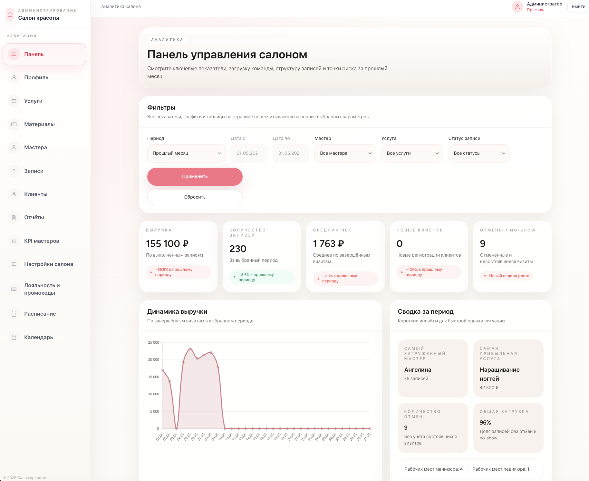

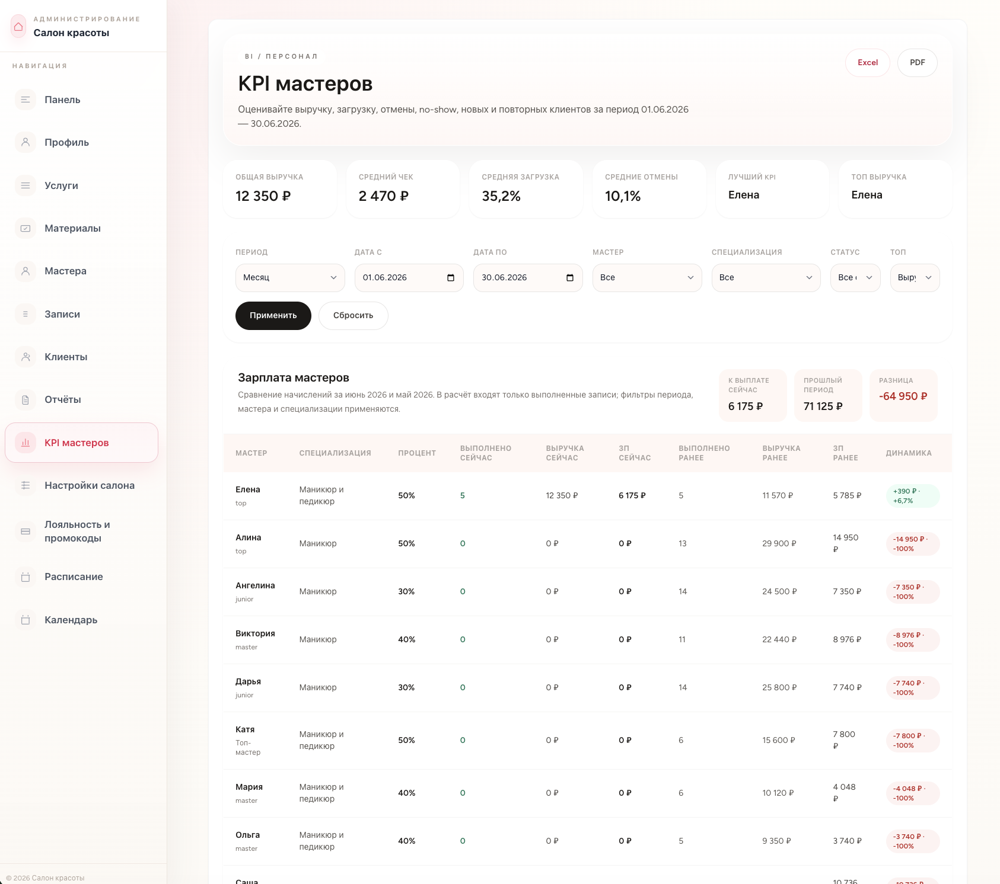

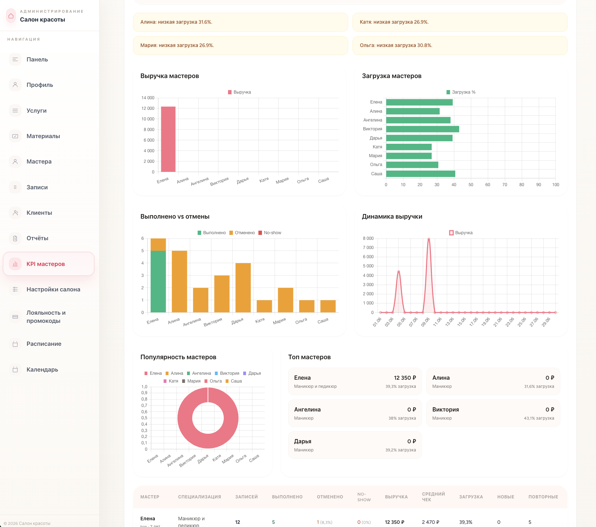

## Основные Экраны

### Онлайн-запись

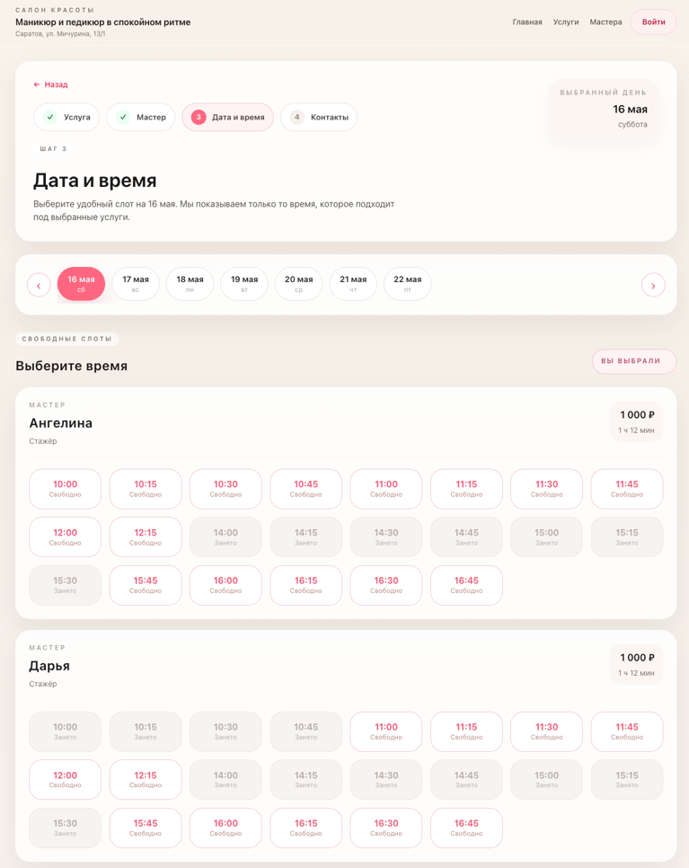

### Управление расписанием

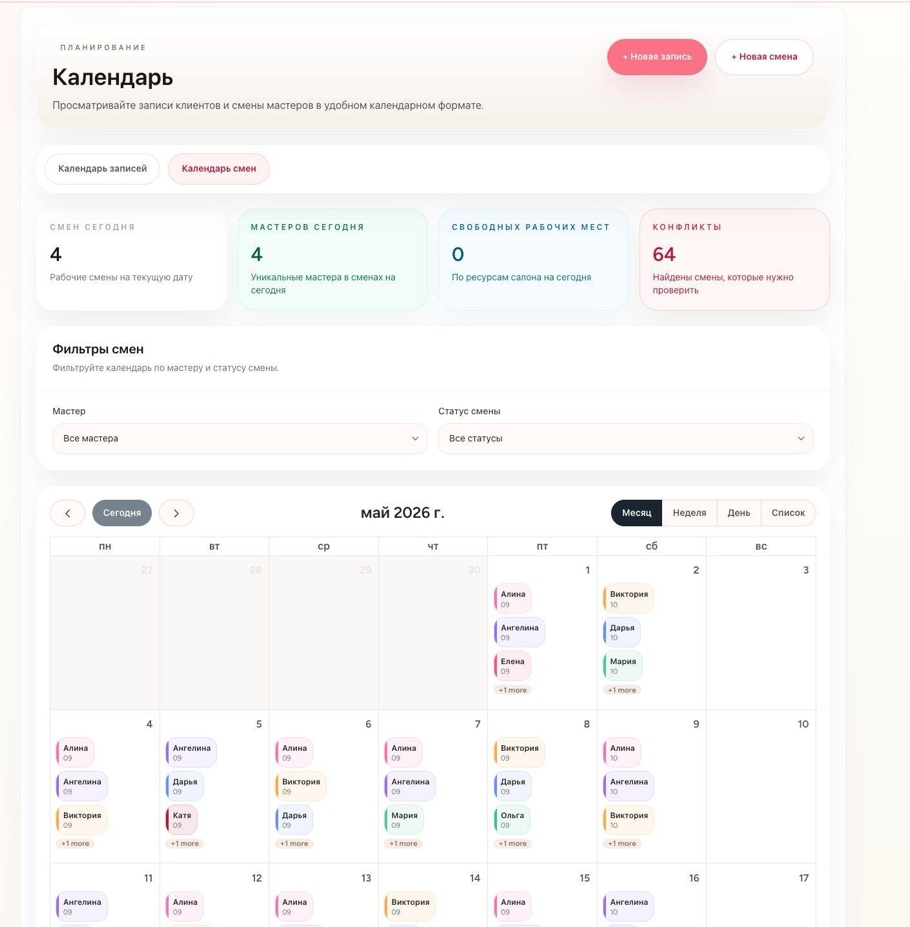

### Учет материалов

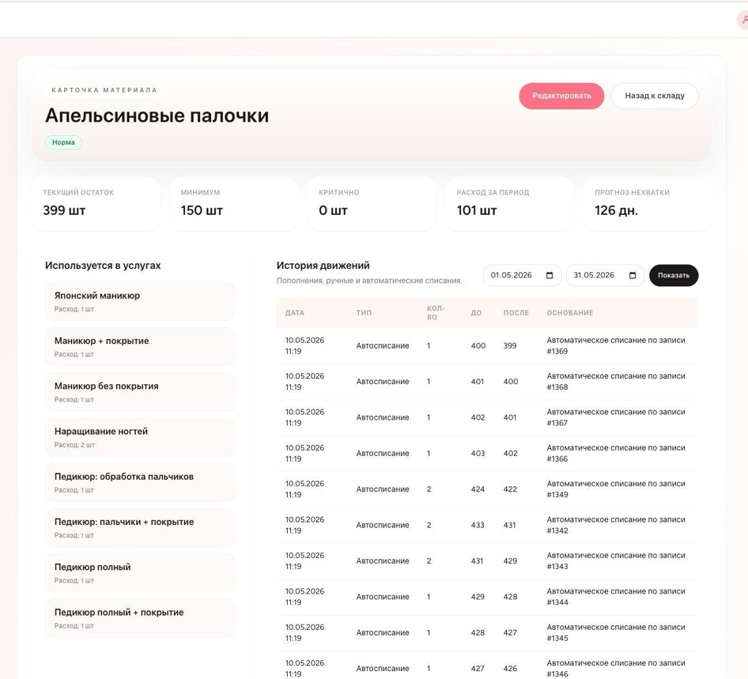

### Отчеты

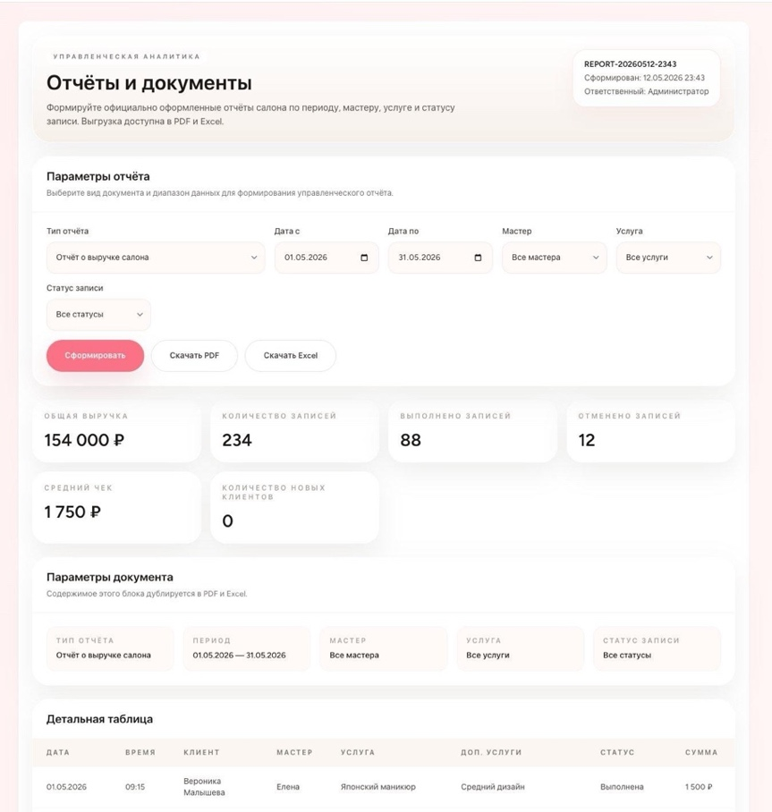

### Личный кабинет клиента

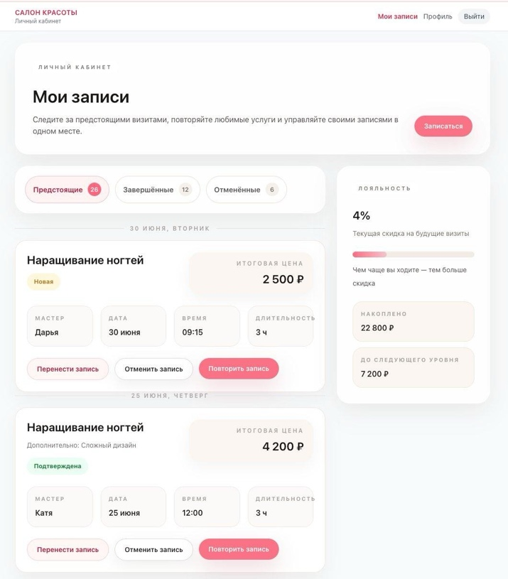

## Использованный Стек

По материалам ВКР система реализована с использованием:

- Laravel 12;
- PHP 8.4;
- MySQL;
- JavaScript;
- Bootstrap;
- Docker.

Стек указан как контекст реализации. Основной фокус репозитория - аналитические артефакты, требования, моделирование и проектирование информационной системы.

## Основные Результаты

По материалам проекта разработанная система:

- объединяет запись клиентов, расписание, учет и аналитику в единой базе данных;
- снижает количество ручных операций администратора;
- уменьшает риск ошибок при работе с расписанием и начислениями;
- проверяет смены, перерывы, занятость мастеров и лимиты рабочих мест;
- поддерживает автоматическое списание материалов по технологическим картам;
- рассчитывает начисления и KPI мастеров по завершенным визитам;
- формирует аналитические панели и отчеты;
- разделяет доступ для администратора, мастера и клиента.

## Структура Репозитория

```text
beauty-salon-information-system
├── README.md
├── docs
│   ├── requirements
│   ├── business-rules
│   └── architecture
├── diagrams
│   ├── bpmn
│   ├── uml
│   ├── erd
│   ├── dfd
│   └── idef3
└── screenshots
    ├── booking
    ├── admin
    ├── master
    └── client
```
