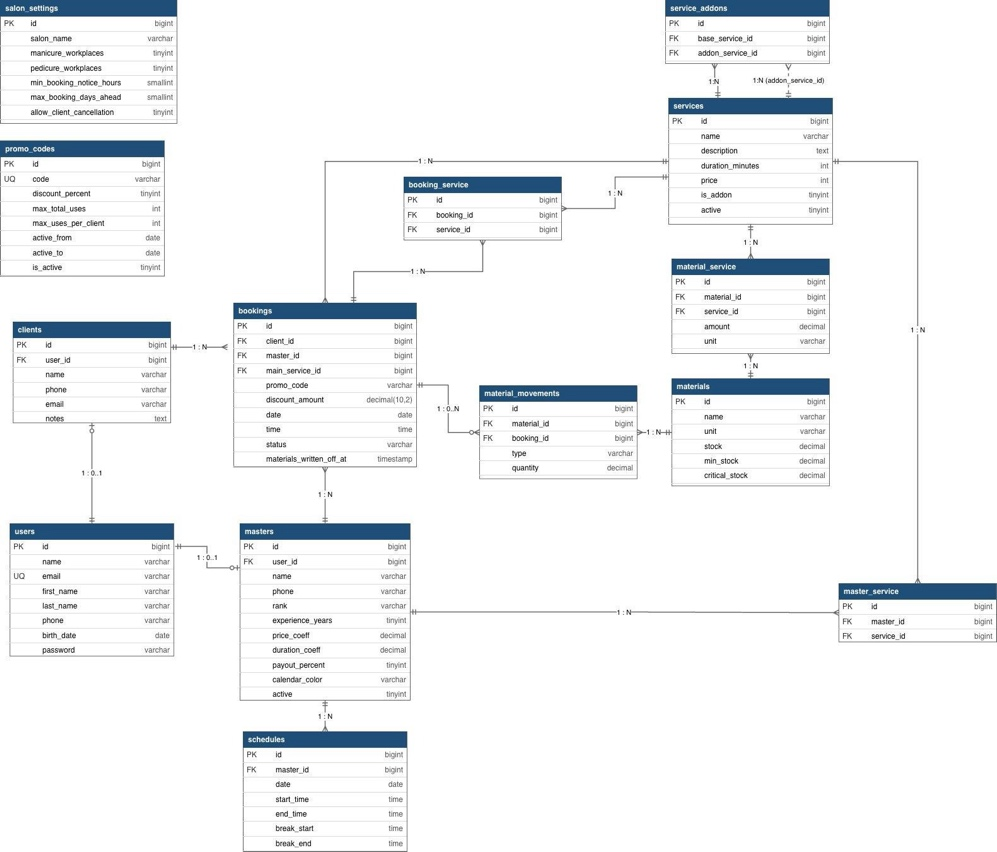

# Проектирование базы данных

В проекте используется реляционная модель данных. Она выбрана потому, что одна запись клиента одновременно связана с несколькими бизнес-объектами: клиентом, мастером, услугой, расписанием, материалами, промокодом и аналитикой.

## Принципы проектирования

- Раздельное хранение клиентов, пользователей, мастеров, услуг и материалов.
- Использование внешних ключей для сохранения целостности связей.
- Таблицы many-to-many для услуг, мастеров, записей и технологических карт материалов.
- Отдельная история движений материалов вместо хранения только текущего остатка.
- Разделение учетных записей пользователей и клиентской базы салона.
- Возможность расширения функциональности через добавление новых сущностей и связей.

## Основные таблицы

| Таблица | Назначение |
| --- | --- |
| `users` | Учетные записи администраторов, мастеров и клиентов с доступом в личный кабинет. |
| `clients` | Клиентская база с контактными данными и заметками администратора. |
| `masters` | Профили мастеров, коэффициенты, процент начисления и цвет календаря. |
| `bookings` | Центральная таблица записей, связанная с клиентом, мастером и основной услугой. |
| `booking_service` | Дополнительные услуги, выбранные в рамках одной записи. |
| `services` | Каталог услуг с длительностью, ценой и признаками активности/дополнительной услуги. |
| `service_addons` | Допустимые комбинации основных и дополнительных услуг. |
| `materials` | Справочник материалов с текущим, минимальным и критическим остатком. |
| `material_service` | Технологические карты: материалы и нормы расхода для услуг. |
| `material_movements` | История пополнений, ручных списаний и автоматических списаний материалов. |
| `schedules` | Смены мастеров с датой, временем начала/окончания и перерывами. |
| `master_service` | Услуги, доступные конкретным мастерам. |
| `promo_codes` | Настройки скидок, сроков действия и лимитов промокодов. |
| `salon_settings` | Лимиты рабочих мест и правила онлайн-записи. |

## ERD

